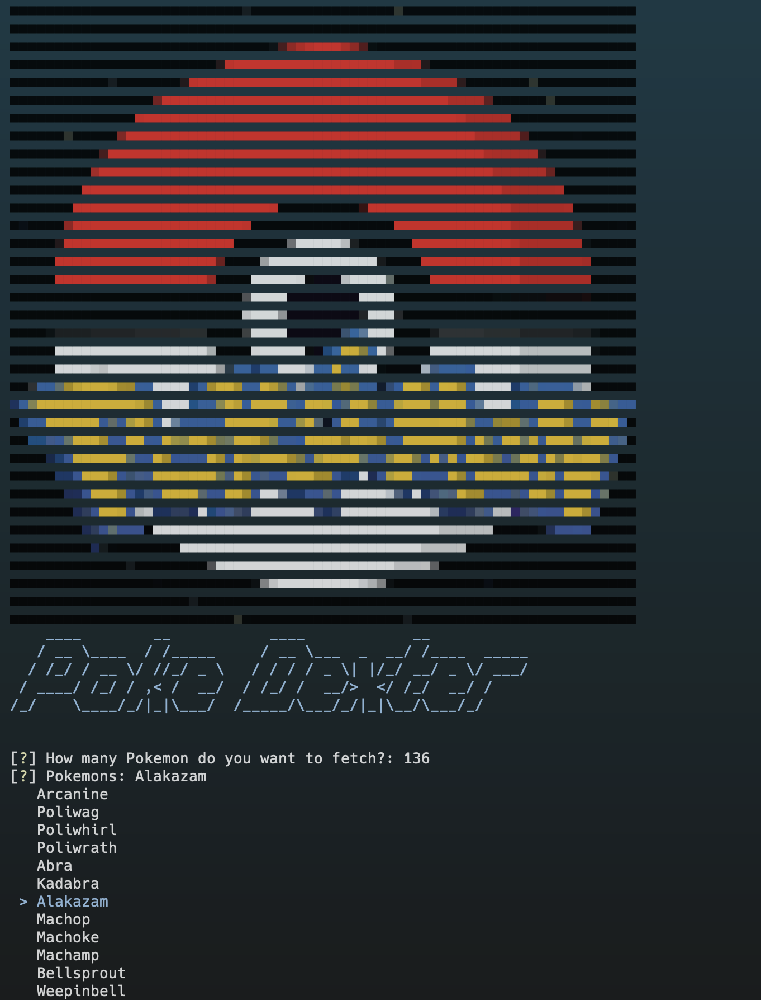
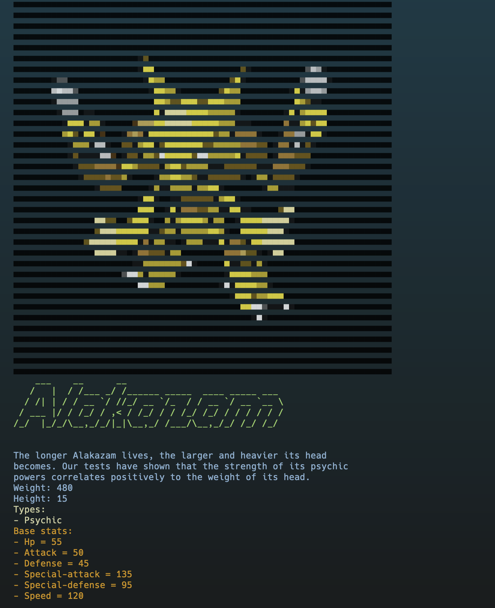
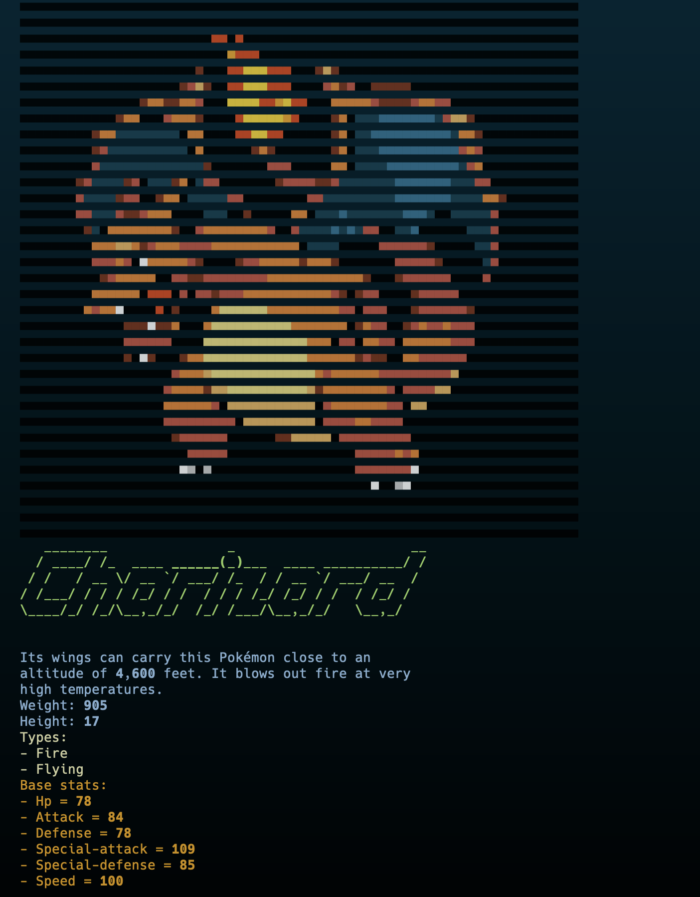

# PokeDexter
#### Video Demo:  https://youtu.be/ATKrEjBN1oM
#### Description:
PokeDexter is a CLI based Pokedex that comes with a TTS to feel like a real pokedex as in the show.
It lists all Pokemon by their order in the real pokedex database.
The data is sourced from the API over at [https://pokeapi.co/](https://pokeapi.co/).
It also displays the image of the pokemon beautifully in the terminal itself.

The following libraries are used to make this program:

- `terminal-img`
- `pyfiglet`
- `rich`
- `inquirer`
- `requests`
- `pyttsx3`

The program makes many API Calls to fetch data, then that data is used to render the images, start the TTS and so on to make a real pokedex like interface.

Made By: Arpan Pandey, New Delhi, India

#### Some screenshots

